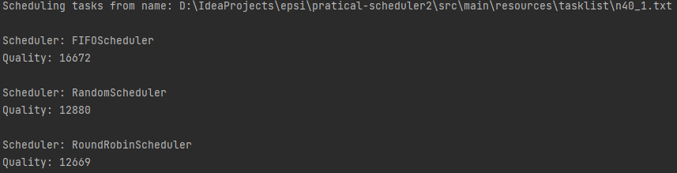

# pratical-scheduler

L’objectif de ce TP est la conception, l’implémentation et l’étude d’heuristiques
pour un problème d’ordonnancement à l’énoncé simple mais appartenant à la classe
des problèmes NP-dur.

## Liste d'algorithmes implémentées

- FIFO
- RoundRobin
- Aléatoire

## Lancer le programme

Pour lancer le programme (Java 8+)

    java -classpath "chemin vers le classpath" Main "Chemin vers instance de test"

### Example de performances des algorithmes

